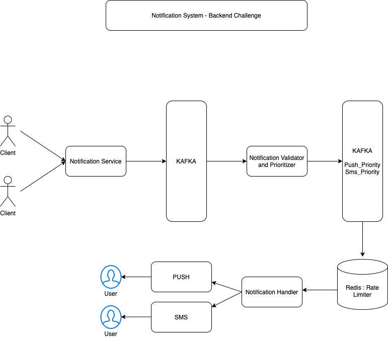
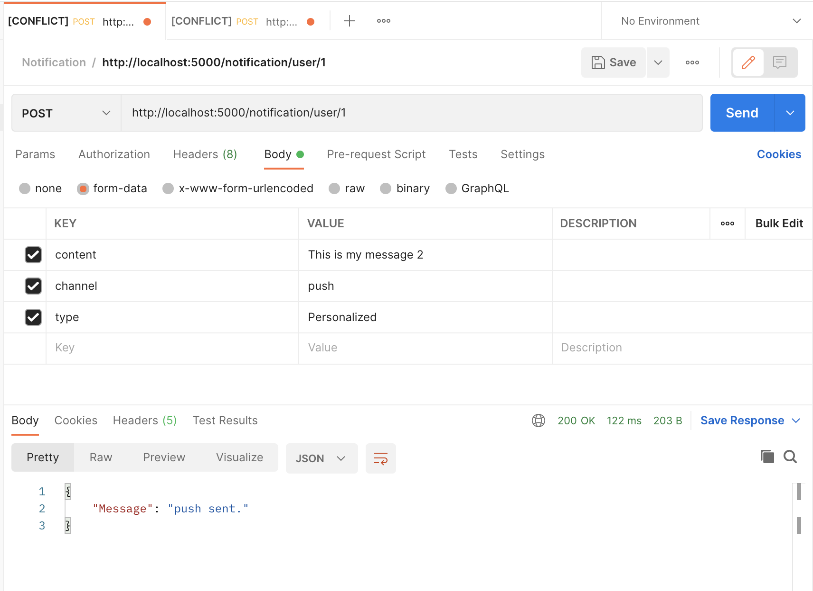
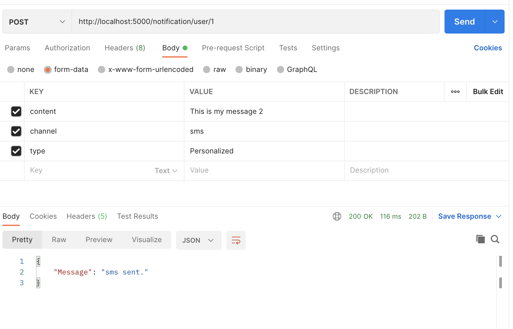
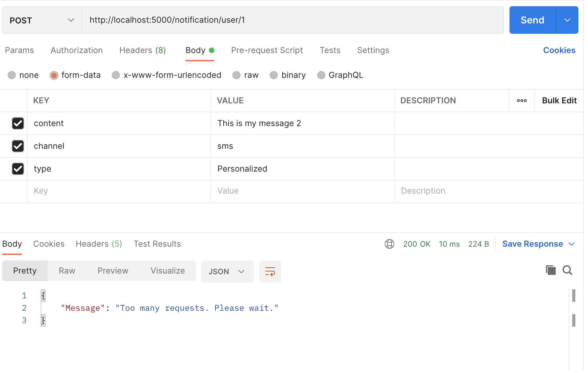
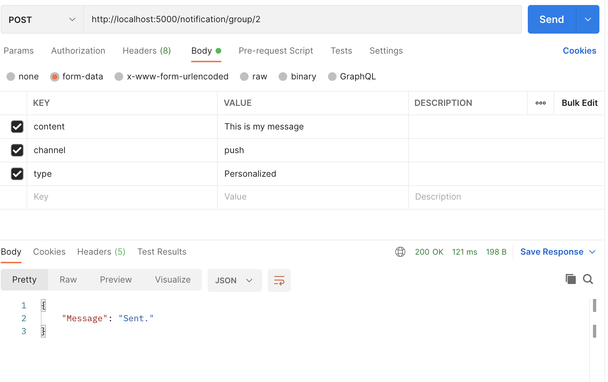
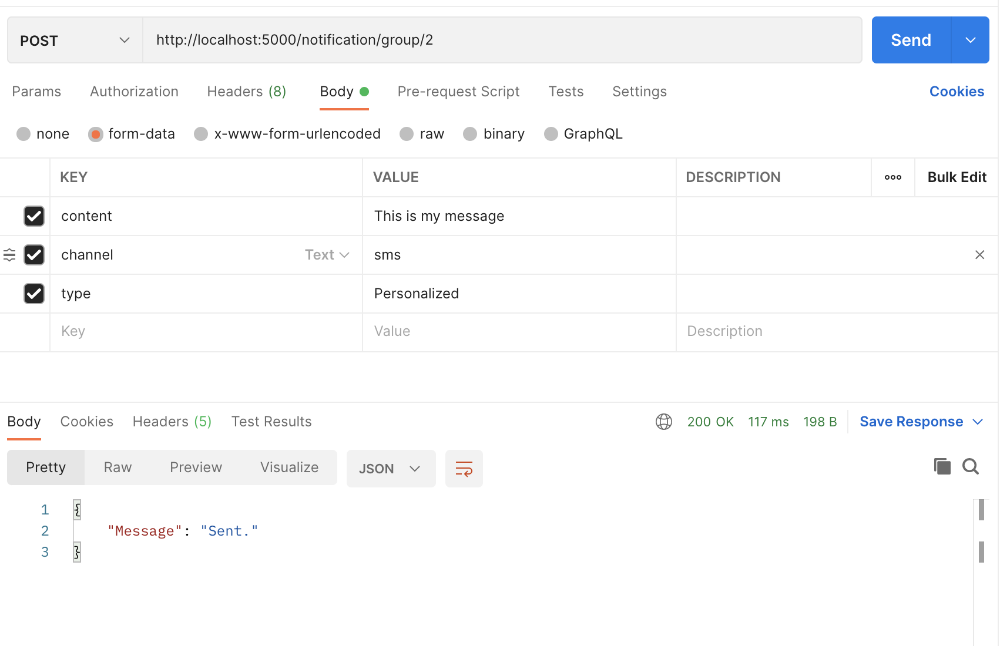

# Rachit -

## TASK:
```
We communicate with our customers via different types of notifications (e.g we send promo codes to customers via SMS, send in-ride push notifications like “Your drop-off station is coming”). And each customer receives a notification in their preferred language.
Specifications
● Notifications Types are as follows:
○ Group notifications which are sent as a text notification to a group of users.
○ Personalized notifications which are sent as a specific text notification to a specific user.
● Notification can be delivered by two types of providers: 
○ SMS
○ Push notifications
● The number of requests that providers (SMS, Push notifications) can handle per
minute are limited.
Requirements
● Implement the notification service.
● Write units tests to test your service the more coverage the better
● Service should be run by docker-compose up.
● Documentation:
○ A simple diagram of the architecture.
○ How to run it.
○ How another microservice would contact this service to send a notification.
○ Future improvements
```

## Basic Architecture


## Usage
```
>> cd NotificationSystem
>> docker-compose build
>> docker-compose up
```

## To stop
```
docker-compose down
```

## How other microservices will contact this service to send notification
```
For simplicity purpose below are the endpoints by which a client can connect:

Personalized::
1 - http://localhost:5000/notification/user/<user_id>
e.g. http://localhost:5000/notification/user/1

METHOD : POST
BODY (Key-Value Pair): 
content:This is my message
channel:sms
type:Personalized

2 - http://localhost:5000/notification/user/<user_id>
e.g. http://localhost:5000/notification/user/1

METHOD : POST
BODY (Key-Value Pair):
content:This is my message
channel:push
type:Personalized

Group::
1 - http://localhost:5000/notification/group/<group_id>
e.g. http://localhost:5000/notification/group/2

METHOD: POST
BODY (Key-Value Pair):
content:This is my message
channel:push
type:Personalized

2 - http://localhost:5000/notification/group/<group_id>
e.g. http://localhost:5000/notification/group/2

METHOD : POST
BODY (Key-Value Pair):
content:This is my message
channel:sms
type:Personalized

```

## Future Improvements

```
1 - We can add more providers like email,IVRS etc. by adding providers unser provider service.
2 - We can enhance bulk notification service to have fraud detection.
3 - We can do request counting to charge pay per use model.
4 - Users can be given liberty to opt out of promotional messages - In this case we can add Preferences DB which can store user preferences.
```

## Output
```USER PUSH```


```USER SMS```


```USER RATE LIMIT CROSSED```


```GROUP PUSH```


```GROUP SMS```


